# RaceBrick

RaceChrono 风格的车载计时器 UI —— **Web 交互原型**（后续移植到 ESP32-S3 + LVGL）。

- 屏幕：**360 × 240 横屏**，像素风格
- 交互：五键物理按键 `Up / Down / Push / Ok / Back`
- 目标：先用 Web 端完整模拟交互与状态机，再替换输入驱动层烧录到真实单板

没有构建步骤，纯静态页面。

```bash
# 方式一：直接打开
open index.html

# 方式二：本地服务（推荐）
python3 -m http.server 8000
# 浏览器访问 http://localhost:8000/
```

键盘映射：`↑/↓` = Up/Down，`Enter` = Ok，`空格` = Push，`Esc` = Back；也可直接点屏幕下方的虚拟按键。
按住任意键 **≥600ms** 触发长按（Up/Down 连续滚动，Back 结束比赛）。

---

## 截图

| 开机 IMU 水平校准 | 主页面 |
|---|---|
| 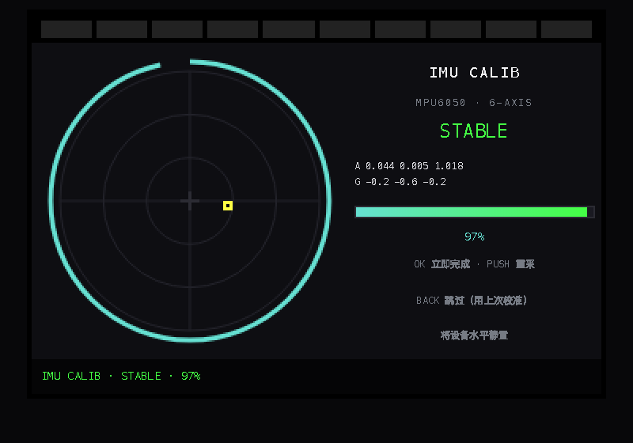 | 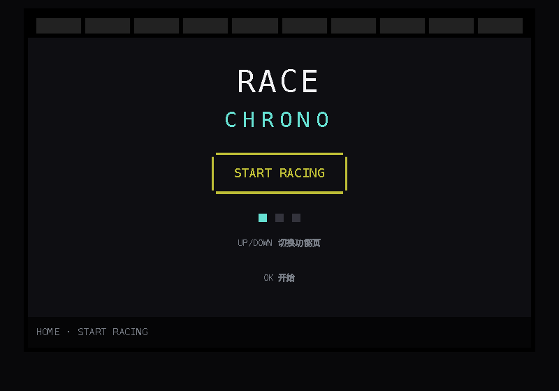 |

| 模式选择 | — |
|---|---|
| 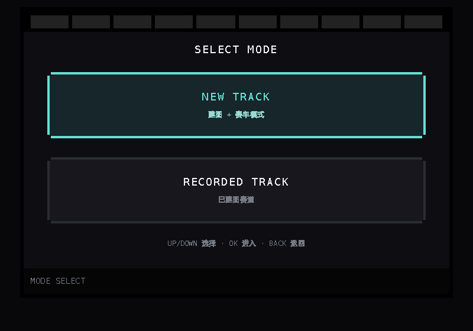 | |

| 标记起始线（未知赛道，仅 GPS 点） | New Track 绘制中（视角跟随） |
|---|---|
| 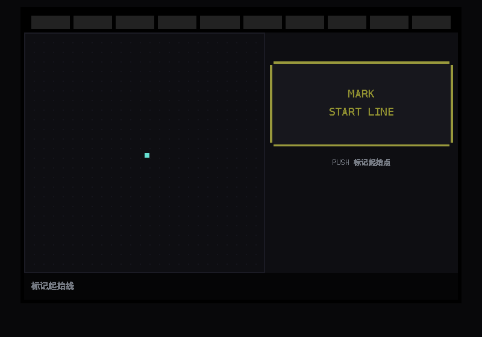 | 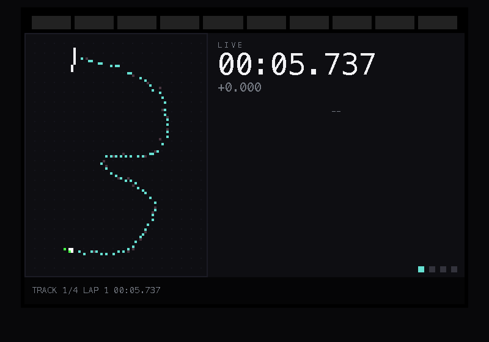 |

比赛界面共 4 个仪表面板，用 **Up/Down 切换**：

| ① TRACK：轨迹 + 大字圈速 + 圈列表 | ② TIMER：全屏巨号圈速 |
|---|---|
| 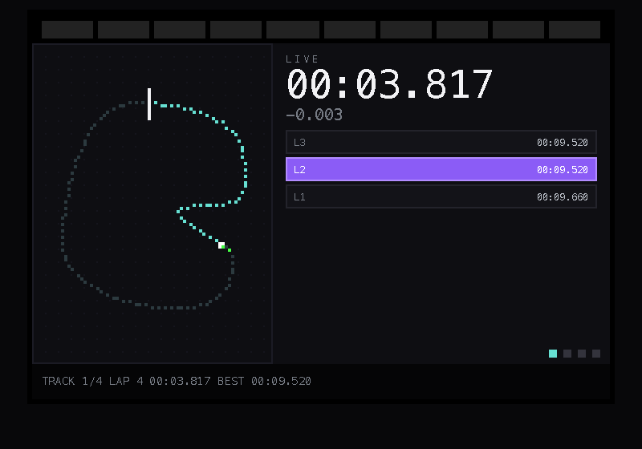 | 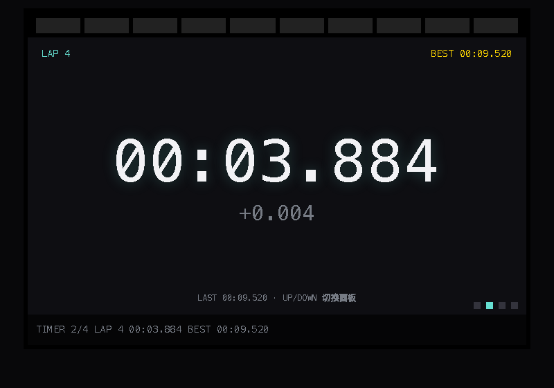 |

| ③ DASH：车速 + 遥测 | ④ SECTOR：分段差值 |
|---|---|
| 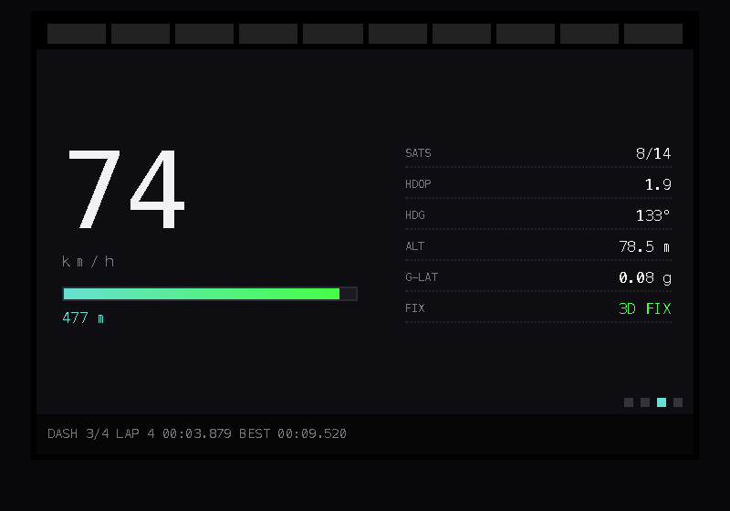 | 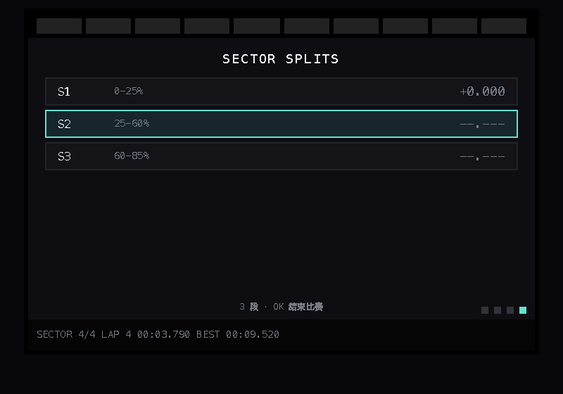 |

| 圈选择（≥2 圈） | Section 分段标记 |
|---|---|
| 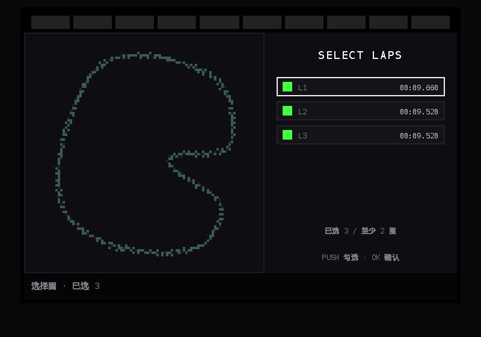 | 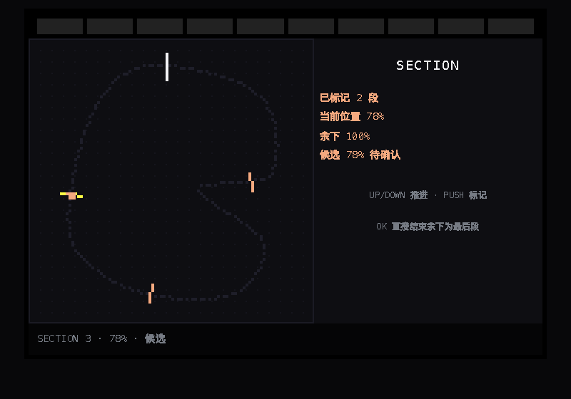 |

| 赛车选择 | 赛道命名 |
|---|---|
| 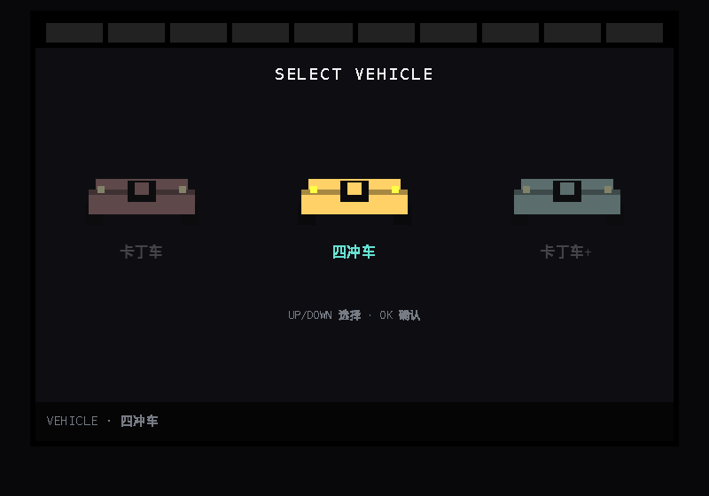 | 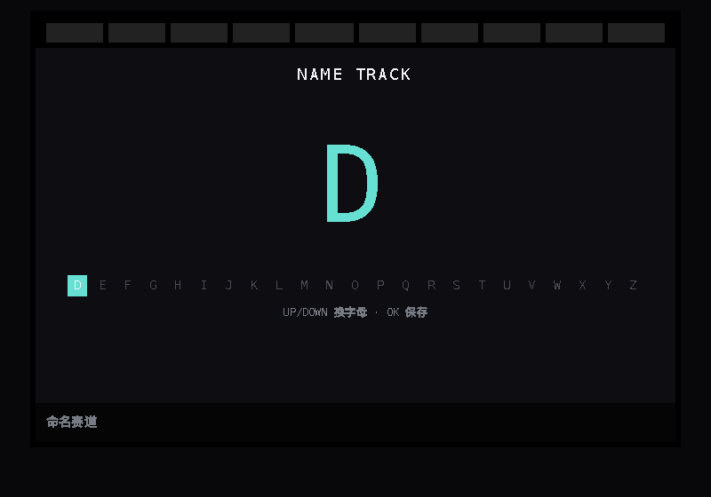 |

| 已建图赛道列表 | 赛后建图确认弹窗 |
|---|---|
| 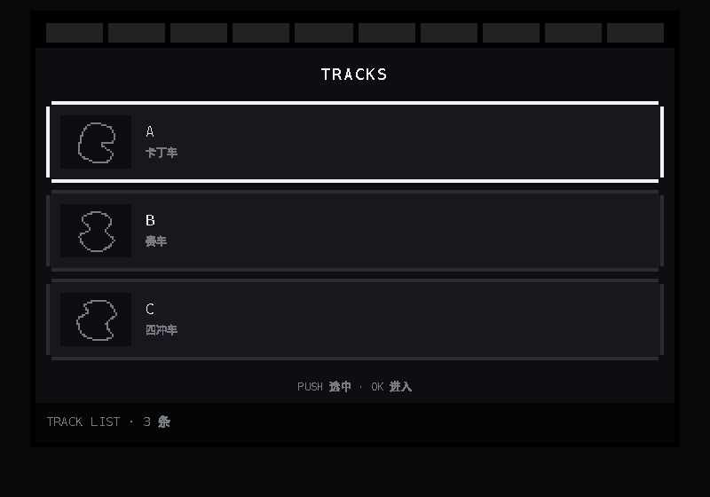 | 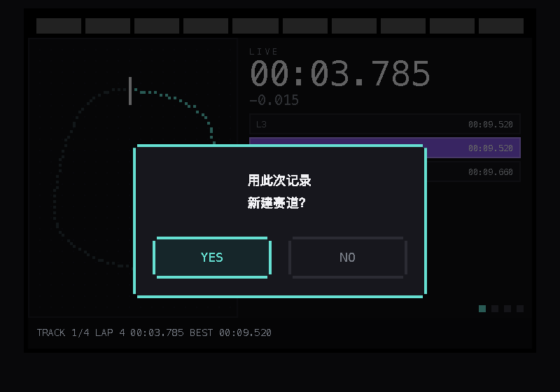 |

| 开赛前选择安装方式 | 历史记录（Race Log） | 单场详情（圈速 / 分段最快） |
|---|---|---|
| 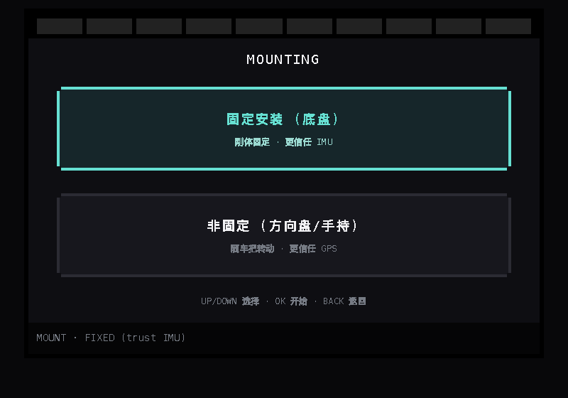 | 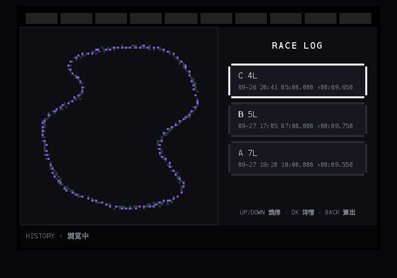 | 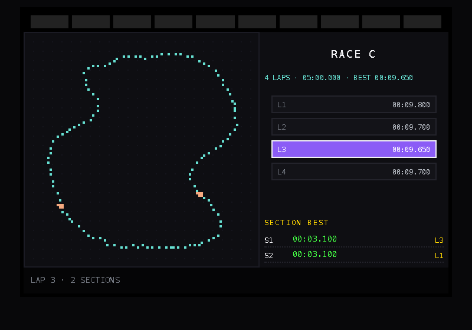 |

| Settings | GNSS 雷达测试（NEO-M9N） |
|---|---|
| 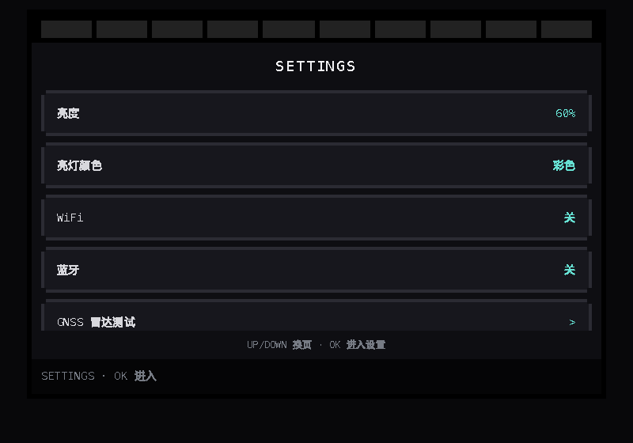 | 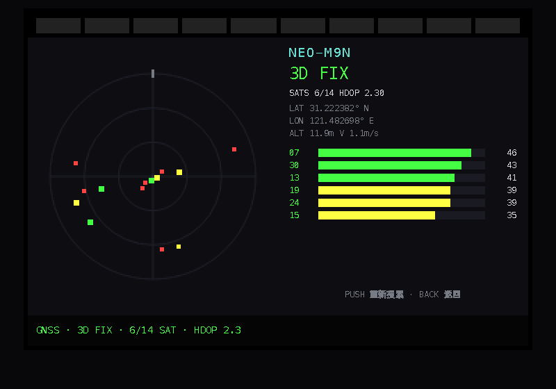 |

---

## 目录结构

```
RaceBrick/
├── index.html          主入口：设备外壳 + 调试面板 + 虚拟按键
├── styles.css          像素风格样式（360×240 横屏、切角边框、动画）
├── js/
│   ├── config.js       全局配置：屏幕尺寸 / 按键时序 / 调色板 / GPIO 映射
│   ├── dom.js          DOM / Canvas 小工具与时间格式化
│   ├── input.js        输入层：键盘 / 屏幕按钮 / GPIO 轮询，长按与连发判定
│   ├── track.js        赛道几何 + RaceEngine（圈判定 / 圈速 / Diff / 遥测 / 传感器融合）
│   ├── gnss.js         NEO-M9N 模拟器（搜星序列 / 天空视图 / 定位解）
│   ├── imu.js          MPU6050 模拟器（零偏 / 噪声）+ GPS/IMU 卡尔曼融合
│   ├── map.js          像素轨迹图渲染 + 车辆图标 / 赛道缩略图
│   ├── screens.js      全部页面与状态机（每个页面一个 class）
│   └── app.js          应用外壳：主循环 / 页面切换动画 / 弹窗 / 状态栏 / 调试
├── docs/               关键截图
├── _test.html          全流程回归测试（headless，见下）
├── _sec.html           Section 逻辑专项测试
└── _shot.html          任意页面预览/截图入口（?clean=1 去掉调试面板）
```

约 3.7k 行；`screens.js`（页面与状态机）和 `track.js`（仿真引擎）是核心。

---

## 交互逻辑

### 1. 按键语义

| 按键 | 短按 | 长按（≥600ms） |
|---|---|---|
| Up | 上移 / 增加 / 切上一个面板 | 连续滚动 |
| Down | 下移 / 减少 / 切下一个面板 | 连续滚动 |
| Push | 触发当前项（标记 / 勾选 / 取消候选） | — |
| Ok | 确认 / 进入 / 接受 | — |
| Back | 返回 / 取消当前层 | 结束比赛（仅比赛中）/ 返回 |

输入层统一发出 `PRESS` / `LONG` / `REPEAT` / `RELEASED` 事件，**UI 层不关心按键来自键盘、屏幕按钮还是 GPIO**。时序常量集中在 `config.js`：
`LONG_PRESS_MS = 600`、`REPEAT_INTERVAL_MS = 110`。

### 2. 页面状态机

```
IMU_CALIB(开机) ──稳定2.5s/Ok/Push/Back──▶ HOME
HOME ──Ok──▶ MODE_SELECT
 │              ├─ New Track ──▶ NEW_TRACK_MARK_START ──Push──▶ MOUNT_SELECT ──Ok──▶ RACING(New)
 │              │                    └─ Back长按 ──▶ CONFIRM「用此次记录新建赛道?」
 │              │                                      ├─ No  ─▶ HOME
 │              │                                      └─ Yes ─▶ LAP_SELECT(≥2圈)
 │              │                                                 └─ Ok ─▶ CONFIRM「标记 Section?」
 │              │                                                           ├─ No  ─▶ VEHICLE_SELECT
 │              │                                                           └─ Yes ─▶ SECTION_MARKING
 │              │                                                                        └─ Ok ─▶ VEHICLE_SELECT
 │              │                                                                                   └─ Ok ─▶ TRACK_NAMING
 │              │                                                                                              └─ Ok ─▶ HOME
 │              └─ Recorded Track ──▶ TRACK_LIST ──Ok──▶ MOUNT_SELECT ──Ok──▶ RACING(Recorded)
 │                                                          ▲                    │
 │                                                          └── Back短按 ────────┘
 │                                                              Back长按 ──▶ HOME
 └─ Up/Down ─▶ 在 HOME / HISTORY / TRACK_EDIT / SETTINGS 四页间切换
HOME ▸ HISTORY ──Ok(进入)──▶ 记录列表 ──Ok──▶ 单场详情（圈速 + 分段最快 + 轨迹）
```

### 3. 主页面（HOME 三页轮播）

`HOME`、`TRACK_EDIT`、`SETTINGS` 用 **Up/Down 换页**。
进入 `TRACK_EDIT` / `SETTINGS` 后先处于「换页模式」，**按 Ok 才进入**，之后再 Up/Down 选择列表项，`Back` 退出编辑回到换页模式——这样不会因为列表吃掉了 Up/Down 而卡在页面里出不去。

### 4. 比赛界面（4 个仪表面板，Up/Down 切换）

| 面板 | 内容 |
|---|---|
| **TRACK** | 轨迹图 + 大字当前圈速 + 圈速列表（最快圈紫底、Recorded 历史最快金底） |
| **TIMER** | 全屏巨号当前圈速 + 与最快圈差值（红慢 / 绿快）+ LAP / BEST / LAST |
| **DASH** | 大字车速 (km/h) + 速度条 + 里程；**G 值表**（g-g 图，带轨迹尾迹）；SATS / HDOP / FIX / KF-σ / HDG / ALT |
| **SECTOR** | 各 Section 区间 + 与最快圈的分段差值，当前所在段高亮 |

右下角有面板指示点，状态栏显示 `TRACK 1/4` 等。`Back` 长按结束比赛。

### 5. LED 圈速 Diff 条

- 屏幕顶部 10 颗像素 LED，左侧 5 颗 = 更慢（红 `#FF4444`），右侧 5 颗 = 更快（绿 `#44FF44`），未点亮深灰 `#222222`
- 基准：本节（本次 Start Racing）最快圈，在**相同轨迹段**比较用时
- 差值 > 0 才触发；每 `0.5s` 差值点亮 1 颗，单侧最多 5 颗，从中间向外点亮

### 6. New Track 的“轨迹逐渐生成”

设备在开始录制时并不知道赛道形状：

- `NEW_TRACK_MARK_START`：只有网格 + GPS 抖动点；标记后只显示起始线与车，不泄露赛道形状
- `RACING(New)`：只画**已录制**的轨迹，取景框按已录制的点动态计算并逐帧缓动（相机跟随），轨迹跑完整圈后视野自然拉远到整条赛道
- `RACING(Recorded)`：赛道已知，直接显示整圈中心线并锁定视野

建图采用**采样-平均法**：把所选各圈按距离重采样为等间距点后逐点平均，得到平滑中心线（计算量低，适合 MCU）。

### 7. Section 分段逻辑

- **Up/Down** 沿轨迹推进光标（短按 2%，长按/连发 5%）；**Push** 标记候选点；**Ok** 确认候选
- 候选可取消：再按一次 Push 取消；`Back` 先取消候选再退出
- **Ok 无候选时**：询问“当前位置→终点作为最后段 / 余下到终点作为最后段”，确认即生成最后一段并进入下一步——不会因为残留候选而卡住
- 候选离上一段太近时自动取消并直接弹出结束确认；光标 ≥98.5% 确认会自动结束

### 8. 开机 IMU 水平校准（MPU6050）

每次开机进入 `IMU_CALIB`：把设备**水平静置**，屏幕左侧是气泡水平仪（气泡 = 实测水平加速度，越居中越水平），右侧显示三轴加速度/角速度、稳定性状态与进度条。

- 判定：对最近的采样窗口求加速度/角速度标准差，低于阈值即 `STABLE`，稳定累计 **2.5s** 自动完成
- 完成后把平均读数写入零偏（`Mpu6050.applyCalibration`），并保存
- **Ok** 立即完成、**Push** 重新采样、**Back** 跳过（沿用上次校准）
- 也可从 `Settings ▸ IMU 水平校准` 重做

### 9. GPS + IMU 卡尔曼融合（轨迹求解）

赛道轨迹由 GPS 与 MPU6050 融合得到，而非直接用原始 GPS：

- **状态** `[x, y, vx, vy]`（本地米制坐标），一步预测 = 用陀螺 yaw 旋转速度向量 + 沿航向叠加纵向加速度，再乘 dt
- **量测** = GPS 定位（带 ~3 m 噪声、8 Hz、偶发丢星），用卡尔曼增益（稳态 alpha-beta 形式）修正位置
- **航向**：陀螺积分，并用 GPS 航向缓慢校正；丢星时纯惯导递推（dead-reckoning）
- **侧向加速度**按轮胎抓地上限 2g 截断，并做低通，供 G 值表使用
- 效果：融合轨迹比原始 GPS 更平滑，实测 RMS 误差约 **2.2 m vs 原始 2.7 m**，且能穿过短暂丢星段；地图上原始 GPS 点以暗色显示、融合轨迹以亮色显示
- 建图（采样-平均法）使用的就是融合后的轨迹

> 参数集中在 `js/config.js` 的 `IMU` 段（校准时长、噪声、GPS 频率、丢星比例）。

### 10. 安装方式与融合权重（开赛前选择）

每次开始比赛（New Track 标记起始线后 / Recorded 选完赛道后）都会进入 `MOUNT_SELECT`：

| 选择 | 含义 | 融合权重 |
|---|---|---|
| **固定安装（底盘）** | IMU 刚体固定在车体不动处 | 更信任 IMU：`alpha=0.45, beta=0.12, accelWeight=0.8` |
| **非固定（方向盘/手持）** | 会随车把转动，测量坐标系在变 | 更信任 GPS、少用 IMU：`alpha=0.85, beta=0.35, accelWeight=0.05` |

- 权重表在 `js/config.js` 的 `FUSION_PROFILES`，由 `engine.setProfile(name)` 应用
- 选“非固定”时还会模拟真实劣化：陀螺混入**转向角速度 dδ/dt**、重力随转向角**泄漏进横向轴**，用来验证“少信 IMU”确实更稳
- 实测（node）：底盘+信任IMU 融合 RMS ≈ **2.5 m**（原始 GPS 2.8 m）；方向盘+信任GPS 融合 ≈ 3.5 m 且不发散——选错权重（方向盘却信任IMU）峰值误差明显变大

### 11. Race 记录（HISTORY 页）

`HOME ▸ HISTORY` 保存每一场比赛：

- 列表：赛道 / 圈数 / 用时 / 最快圈（如 “10 分钟跑 7 圈”），左侧叠加显示该场轨迹，最快圈紫色高亮
- 详情：逐圈圈速列表（最快圈紫底、可上下翻看并对应该圈轨迹）、**每个 Section 的最快分段成绩及出现在第几圈**（`S1 00:03.10 @L3`）
- 数据来源：比赛结束时 `app.recordRace(engine)` 记录该场（时长 = 仿真累计时间、圈速、逐段用时、融合轨迹）；开机时 `app.seedHistory()` 会预置几场演示记录
- 交互同样带“进入门控”：在 HISTORY 页先按 Ok 进入列表，再用 Up/Down 选择，Back 退出

### 12. GNSS 雷达测试（NEO-M9N）

`Settings ▸ GNSS 雷达测试`：

- 左侧**天空视图**：按方位角/仰角布点，颜色按信噪比（绿 ≥40 / 黄 ≥30 / 红 <30），已参与定位的卫星方块更大
- 右侧：机型、Fix 状态（`NO FIX → 2D → 3D`）、`SATS 已用/可见`、`HDOP`、经纬度/高度/速度，以及按信噪比排序的**卫星列表（强度条 + C/N0）**
- 模拟冷启动搜星过程（C/N0 逐颗爬升），`Push` 重新搜索

---

## 与 ESP32-S3 / LVGL 的对应关系

| Web 原型 | 真实单板 |
|---|---|
| `.screen` + `div` 页面 | `lv_obj` 页面 + `lv_scr_load_anim()` 滑入/淡入 |
| `js/screens.js` 状态机 | 同一套状态机（C 结构体 / 函数表） |
| `js/map.js` Canvas 像素绘制 | `lv_canvas` 或 `lv_obj` 点阵 |
| `RC.Mpu6050`（`js/imu.js`） | MPU6050 I2C 读寄存器 + 零偏校准 |
| `RC.KalmanFusion` | 同一融合算法（C 实现），吃 UBX fix + IMU 采样 |
| LED Diff 条（10 个 `.led`） | 10 个 `lv_obj` 方块 + 颜色样式 |
| `RC.Input`（键盘/屏幕/GPIO 轮询） | GPIO 中断 + 消抖，实现同一 `getButtonState()` |

**分层原则**：UI 绘制层与输入驱动层完全分离。移植时只需替换输入来源：

```js
// js/input.js —— 真实端传入一个对象即可，其余时序逻辑不变
input.attachGPIO({
  getButtonState() {           // 返回 { Up, Down, Push, Ok, Back } 布尔
    return { Up: gpioRead(12), Down: gpioRead(13), /* ... */ };
  },
});
```

预留 GPIO 映射（`js/config.js`，可改成 JSON 注入）：

```json
{ "up": 12, "down": 13, "push": 14, "ok": 27, "back": 26, "led_start": 32, "led_end": 39 }
```

渲染像素风格：`border-radius: 0`、关闭抗锯齿、切角边框；移植到 LVGL 时用 `lv_style_set_radius(0)` 并关闭抗锯齿。

---

## 调试与测试

- **调试面板**（`index.html` 右侧）：当前状态、按住键、圈速/Diff、模拟速度 0.5x–4x、快进整圈、GPIO 映射、事件日志
- **`_shot.html`**：预览任意页面，如 `_shot.html#racing` / `#dash` / `#gnss`；加 `?clean=1` 隐藏调试面板（README 截图即由此生成）
  - 可用 hash：`home mode mark build racing recorded timer dash sector laps section vehicle naming list settings confirm gnss`
- **`_test.html`**：headless 全流程回归（建图 + Recorded + 面板切换 + 家庭页导航 + GNSS）
- **`_sec.html`**：Section 逻辑专项用例（连续标记、取消候选、无效候选自愈、直接结束等）

```bash
# 运行回归（需要 Chrome），输出 STATES / ERRORS / TRACKS
"/Applications/Google Chrome.app/Contents/MacOS/Google Chrome" \
  --headless=new --disable-gpu --virtual-time-budget=20000 \
  --dump-dom "file://$PWD/_test.html" | grep -o 'id="testout">[^<]*' -A6
```

---

## 路线图

- [x] Web 交互原型（状态机 / 动画 / 仿真数据）
- [x] 横屏 360×240、像素风格、面板切换
- [x] New Track 轨迹渐进绘制与相机跟随
- [x] GNSS（NEO-M9N）雷达测试页
- [x] MPU6050 开机水平校准 + GPS/IMU 卡尔曼融合 + DASH G 值表
- [x] 开赛前安装方式选择（按安装方式调整 IMU/GPS 权重）
- [x] Race 历史记录页（圈速 / 分段最快在第几圈 / 轨迹）
- [ ] 亮度/亮灯颜色设置真正作用到画面与背光
- [ ] 真实 GPS/IMU 轨迹导入回放
- [ ] 移植到 ESP32-S3 + LVGL，接入真实 GPIO / UBX / MPU6050
